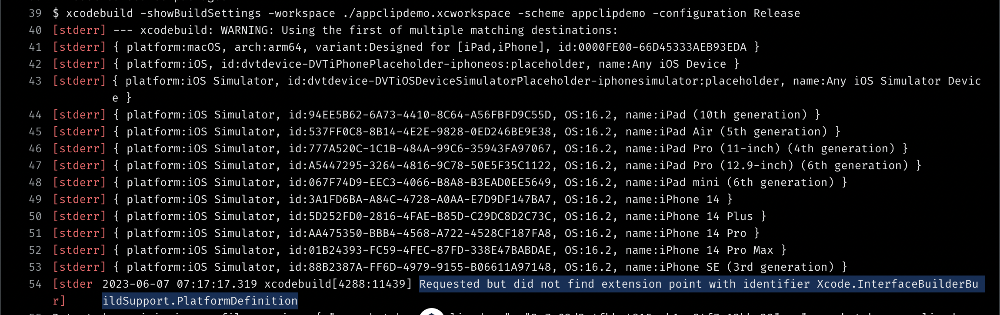

# App Clip

- [App Clipの配信](https://developer.apple.com/jp/documentation/app_clips/distributing_your_app_clip/)
- [App Clipの起動体験のテスト](https://developer.apple.com/jp/documentation/app_clips/testing_your_app_clip_s_launch_experience/)

## EAS ビルドエラー

XCodeでプロジェクトの設定などを調整する必要がありそう（[参考](https://zenn.dev/yahiro/scraps/3cf3e728a258aa)）。  
react-native-app-clip の AppConfig でいろいろとプロジェクトの設定などを変更していると思うのでそこに問題があるのかもしれない。
